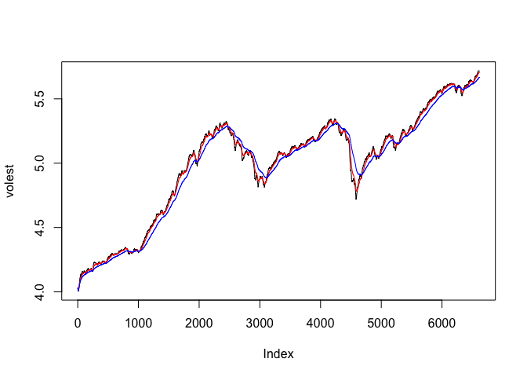

MSDS6306\_405\_HW11\_JackNelson
================
Jack Nelson
4/4/2017

Uncomment and install packages if you don't have it
install.packages("tseries")

``` r
library(tseries)
```

S&P 500 (^GSPC)
SNP - SNP Real Time Price. Currency in USD

``` r
# TODO: Download the data of SP500 '^gspc'.
SNPdata <- get.hist.quote('^gspc',quote="Close")
```

``` r
# TODO: Calculate the log returns, which is the subtractration of log(lag(SNPdata)) and log(SNPdata)
SNPret <- log(log(SNPdata)) - log(SNPdata)
```

``` r
# TODO: Calculate volatility measure that is to multiply sd(SNPret),sqrt(250), 100
SNPvol <- sd(SNPret)*sqrt(250)*100
```

Define getVol function for volatility

``` r
getVol <- function(d, logrets) {
    var = 0
    lam = 0
    varlist <- c()

    for (r in logrets) {
        lam = lam*(1 - 1/d) + 1
      var = (1 - 1/lam)*var + (1/lam)*r^2
        varlist <- c(varlist, var)
    }

    sqrt(varlist)
}
```

Calculate volatility over entire length of series for various three different decay factors: 10 30. 100

``` r
# TODO: call getVol function with the parameters: 10,SNPret
volest <- getVol(10,SNPret)
```

``` r
# TODO: call getVol function with the parameters: 30,SNPret
volest2 <- getVol(30,SNPret)
```

``` r
# TODO: call getVol function with the parameters: 100,SNPret
volest3 <- getVol(100,SNPret)
```

Plot the results, overlaying the volatility curves on the data, just as was done in the S&P example.

``` r
plot(volest,type="l")

# TODO: Add connected line segments for volest2 with the parameters: type="l",col="red"
# hint: look at oilExerciseCode.R file at the live discussion
lines(volest2, type="l", col="red")

# TODO: Add connected line segments for volest3 with the parameters: type="l",col="blue"
lines(volest3, type="l", col="blue")
```


